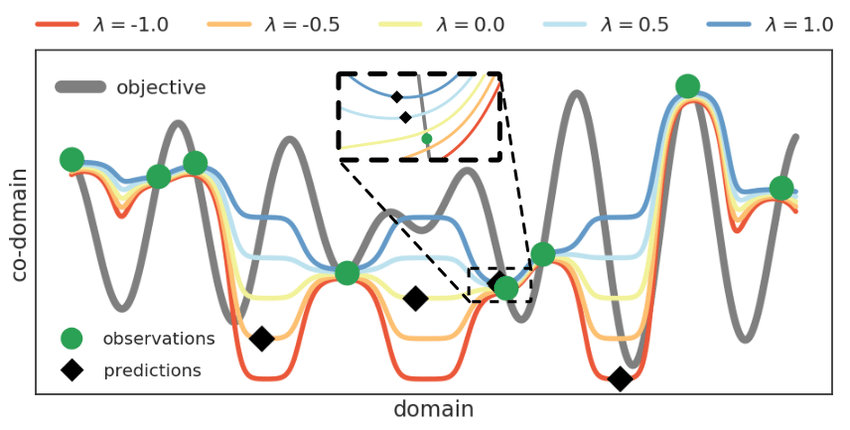

# Bayesian Optimization of Gaussian Processes with Applications to Performance Tuning

## Motivation

The author is a Java Virtual Machine (JVM) engineer. He doesn't know deeply machine learning, but he is interested at optimizing JVM processes.
His motivation is the Twitter microservices, which are coded in Java/Scala (both JVM languages). If the process is not somehow optimized, the energy cost is huge, since servers tend to heat the environment and it is needed coolers to keep the system.

However, we can think of JVM as a composition of several layers. The hardware is the top layer, and each layer has its parameters. Thus, tuning JVM is really hard. There are a lot of parameters and combinations to test, and that makes the problem really hard or even impossible to be solved. Thus, every time someone tries to change JVM design, this person has to make a lot of implementation choices.

## Models

In few words, what we want is to optimize a function, called an objective function, with respect to some parameters. We add some constraints in order to maintain the solution inside a finite range. The difference is that the function is unknown. The author calls that an black-box modelling.

How do we model the function? We use our observations to do that. For example, we have a linear function with only one parameter. The process is to fit a line with my obsevations in order to optimize some critherion (maximum likehood,minimum deviation, etc). If we get more points, then the process is done all over again. 

This model is known as a parametric model. What we are going to use, however, is a non-parametric model. That second model is superior in the sense that it doesn't suffer from overfitting, it is capable of adjusting and scalling as we give more data to it. 

The real problem is the uncertainty. There are two main sources: 

* we don't know the shape of the function. The idea here is to use probabilistic models to measure the uncertainty. Even
though we've made a measurement at two different points, we have some uncertainty about what the shape of the function is in between, and so we allow for that uncertainty. 

* Another other source of uncertainty is the noise. Our data might have some noise.

## Gaussian Processes

The idea of this topic is to give an intuition of a Gaussian Process. Thus, the mathematical details will not be explored and fully explained.

There are two interpretations of a Gaussian Process:

* A vector of uncountably many gaussian variables with given mean and joint covariate distribution. 

* A distribution over functions.

In mathematical terms, we draw two functions instead of one: one "mean function" (mu X) and one "variation function" (KX).

The Gaussian Process is as follows: We select some points. From these points, we draw a gaussian distribution, which gives us a courbe. We can then pick up others points, and redo the process. For every draw that we make of this Gaussian Process, you end up getting a curve that passes through these points. In the noiseless case, those values are actually the true values of the objective function.

## Acquisition Functions

What is an acquisition function? It is a function designed to substitute the objective function. The advantage of doing so is that this function is much easier to evaluate than the original, black-box function. The most commn acquistion function is Thomas sampling. 

What do we do after the Gaussian Process? We can look at two things:

* Point that optimizes. In a Gaussian Process, many functions can be created. Figure 1 ilustrates several functions drawn from 8 points.If we pickup one function, it tells us that it has the best value at this point, that's the point at which we'll do the sampling. 

* Probability of improvement. We try to pick a point to sample at which that probability of improvement is maximized.

## Optimizing Performance Parameters

What we want to do here is a sort of cross-validation. We have several functions, which one will we pick? We do that with that algorithm:

We limit all the parameters to certain values. After that, we will set a SLA (Service Level Agreement). Basically, the SLA tells me which values of the function to test are acceptable.

Finally, for a given set of parameters, we test the function generated, and if it meets the SLA standards, we put this function in a list. We do that for every combination of parameters and then we choose the best fuction possible according to the SLA.

